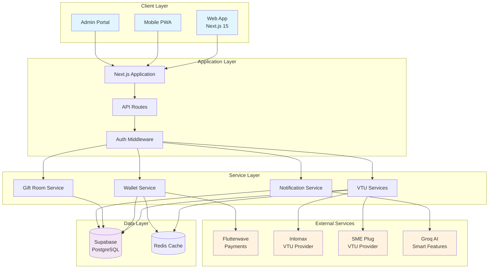
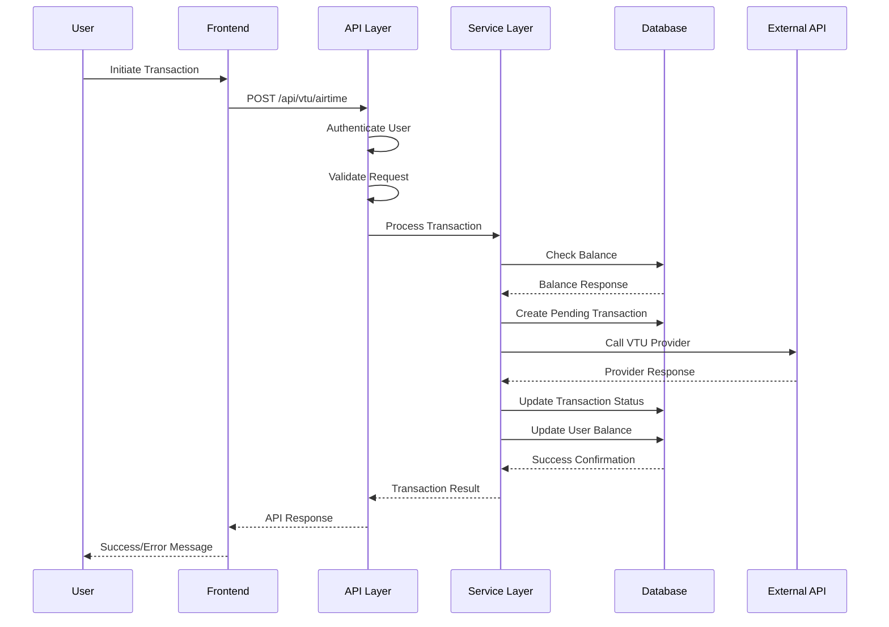
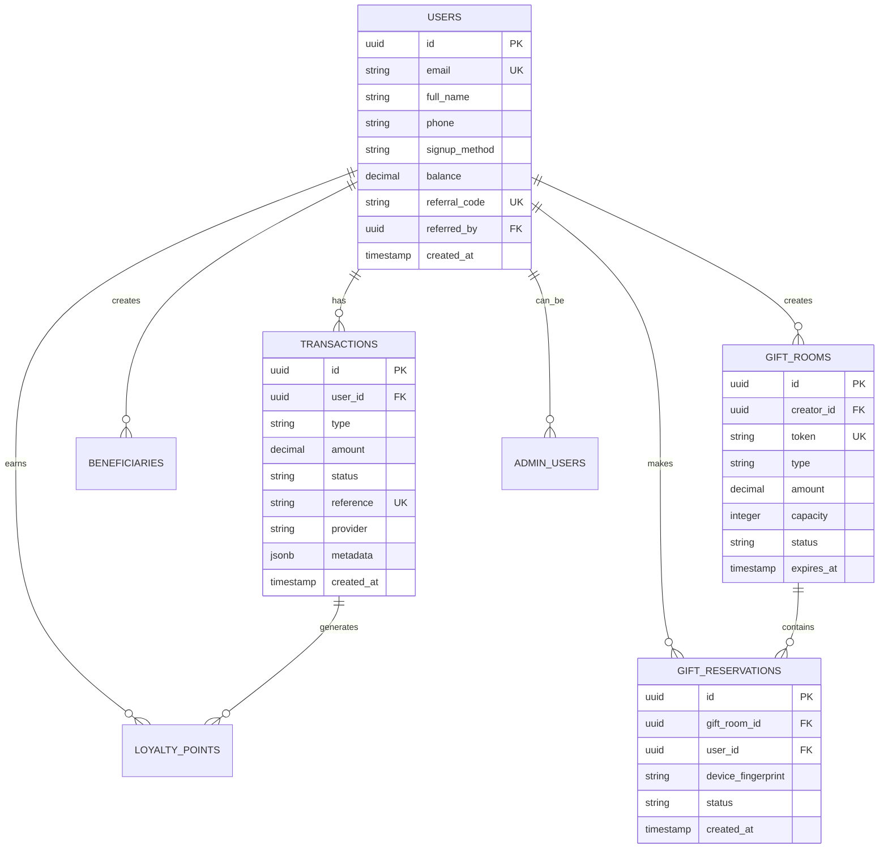
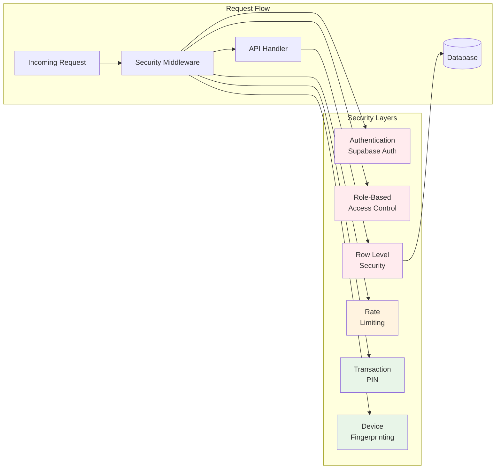
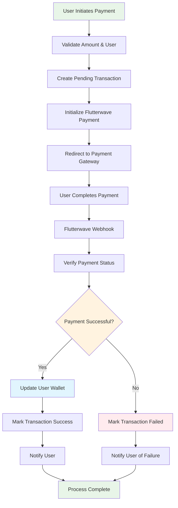
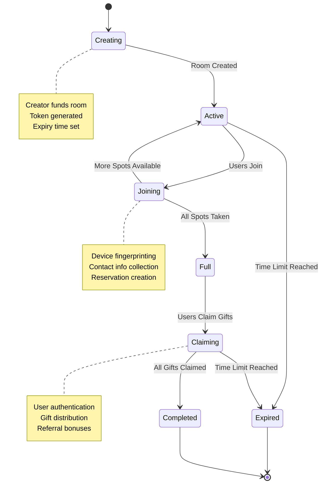
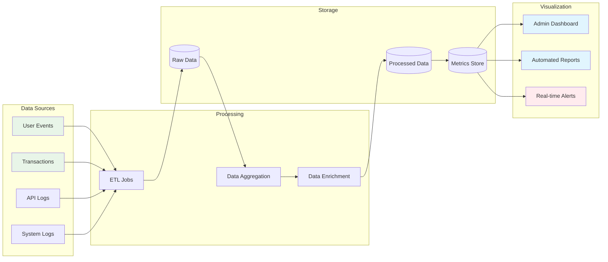
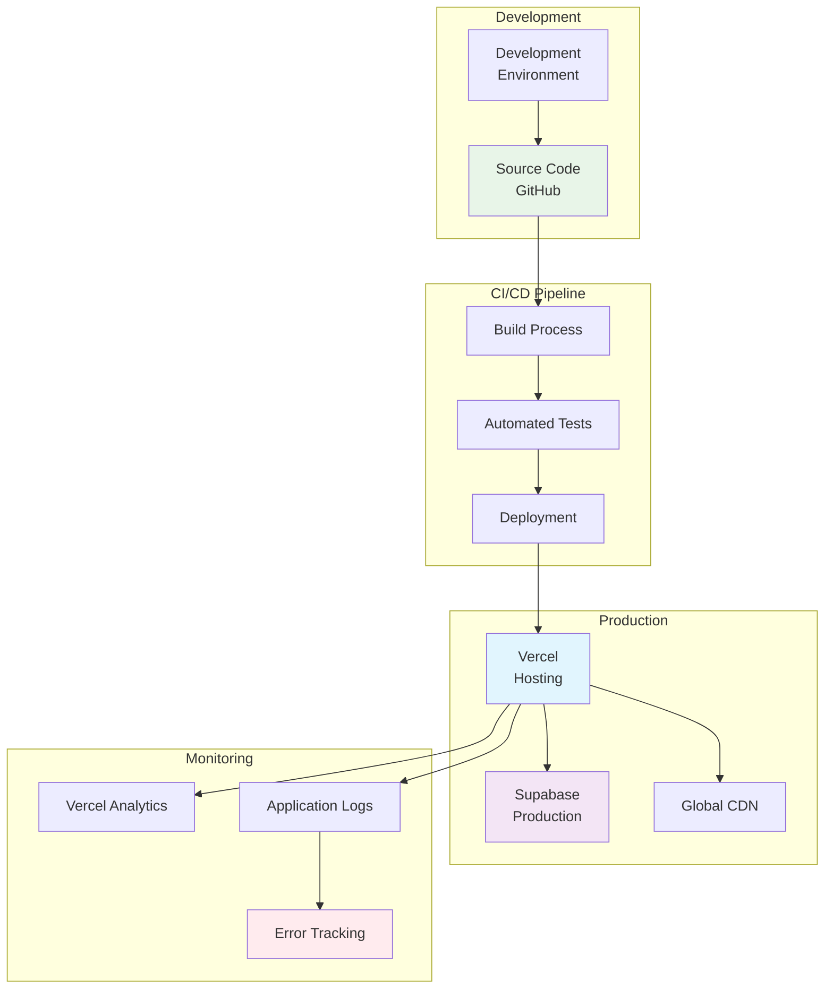
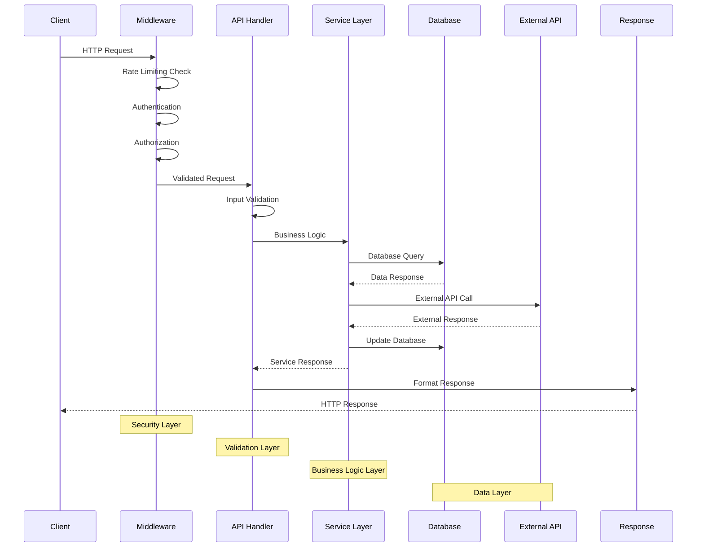
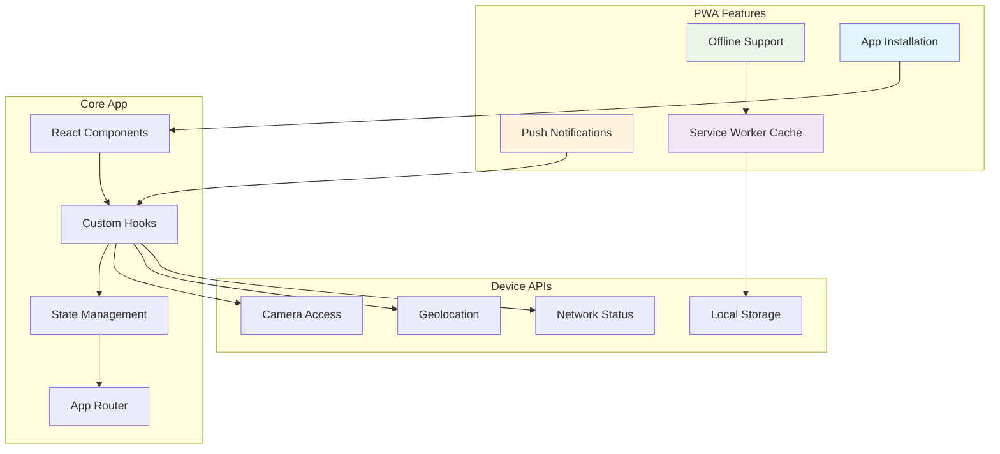

# TADA VTU - Visual Architecture Diagrams

## 🏗️ **High-Level System Architecture**

## 🔄 **Data Flow Architecture**

## 🗄️ **Database Schema Relationships**

## 🔐 **Security Architecture**

## 💳 **Payment Processing Flow**

## 🎁 **Gift Room System Flow**

## 📊 **Analytics Data Pipeline**

## 🚀 **Deployment Architecture**

## 🔄 **API Request Lifecycle**

## 📱 **Mobile PWA Architecture**

This visual architecture documentation provides comprehensive diagrams showing how all components of your TADA VTU system interact, from high-level architecture down to specific data flows and security measures.