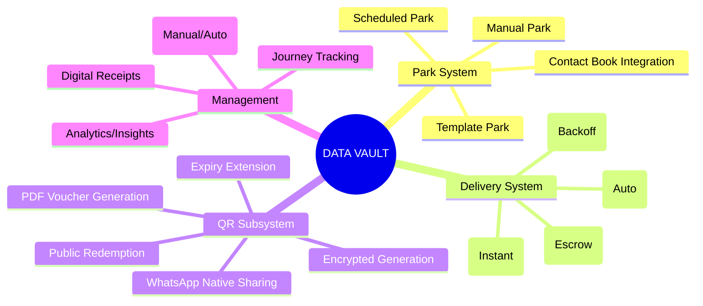
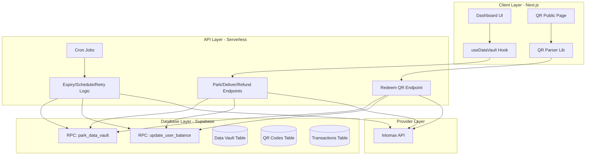
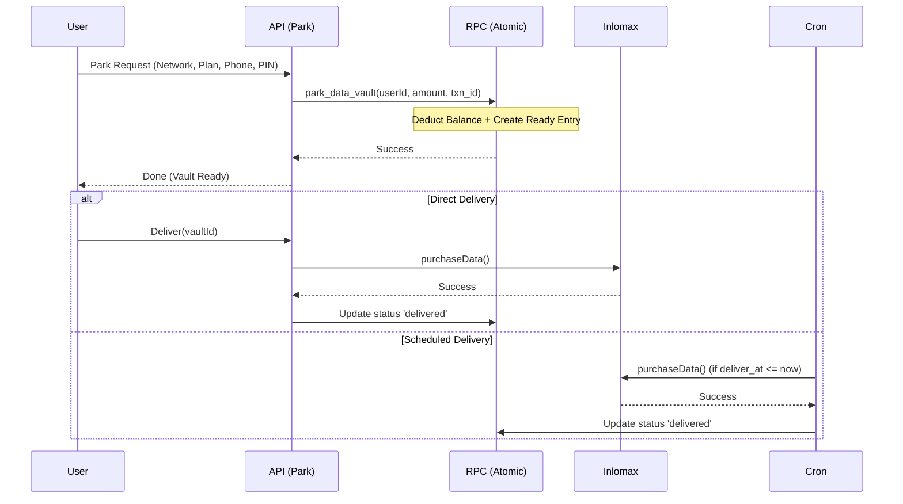
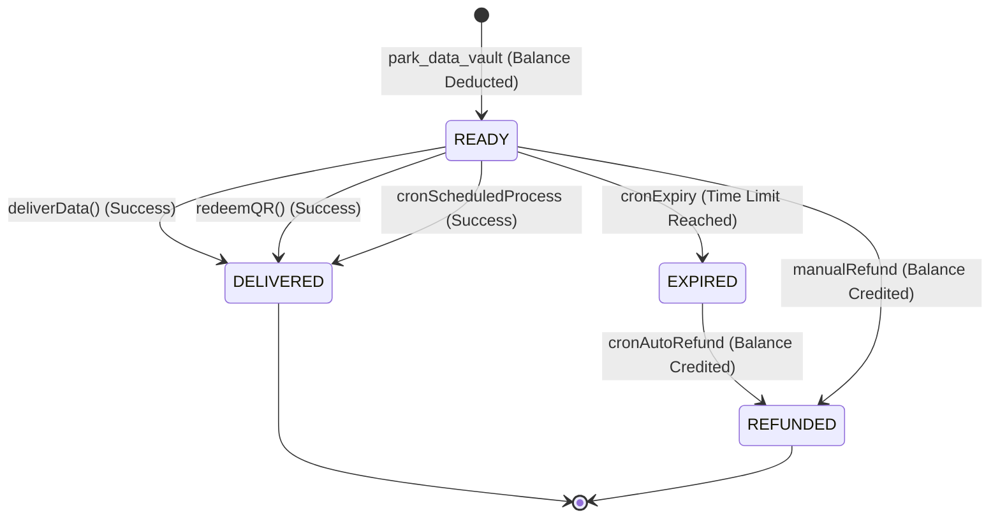

# Data Vault: Master System Blueprint
> TADA VTU · Unified Technical Architecture · May 2026

This document provides a comprehensive, professional-grade blueprint of the Data Vault feature, detailing its hierarchical structure, data movement, and logical nervous system.

---

## 1. Feature Map (The Functional Hierarchy)



---

## 2. Architecture Blueprint (The Infrastructure)



---

## 3. Data Pipelines (The Workflow)

### 3.1 Park & Delivery Pipeline


---

## 4. Skeletal System (File & Database Structure)

### 4.1 File System Skeleton
```text
src/
├── app/
│   ├── dashboard/data-vault/page.tsx      # Brain (UI Controller)
│   ├── api/data-vault/                    # Heart (API Endpoints)
│   │   ├── park | deliver | refund | list
│   │   ├── generate-qr | redeem-qr | extend-qr
│   │   └── receipt/                       # Documentation Generator
│   ├── api/cron/process-vault-expiry/     # Autonomic Nervous System
│   └── vault/qr/[qrData]/page.tsx         # Public Sensory Input
├── components/vault-qr-modal.tsx          # Interface (UI Component)
├── hooks/useDataVault.ts                  # Peripheral Nerves (SWR Hook)
└── lib/qr-generator.ts                    # Genetic Code (Encoding/Decoding)
```

### 4.2 Database Skeleton (Schema)
| System | Table | Key Columns |
|---|---|---|
| **Core** | `data_vault` | `id`, `user_id`, `status`, `deliver_at`, `retry_count`, `freeze_until` |
| **Auth** | `profiles` | `balance`, `pin` |
| **Audit** | `transactions` | `amount`, `reference`, `type: data`, `status` |
| **Sense** | `vault_qr_codes` | `id`, `qr_data`, `locked_to_phone`, `used_at` |
| **Memory** | `tada_contacts` | `name`, `phone`, `network` |

---

## 5. Circulatory System (The Data Pulse)

The Circulatory System moves **Value** (Naira) and **Utility** (Data) between entities.

1. **The Debit Pulse**: Balance moves from `profiles` → `transactions` (negative) → `data_vault` (held as 'ready').
2. **The Delivery Pulse**: `data_vault` ('ready') → Inlomax Request → `transactions` (zero-amount delivery log) → `data_vault` ('delivered').
3. **The Refund Pulse**: `data_vault` ('ready' or 'expired') → `profiles` (balance credit) → `transactions` ('refunded') → `data_vault` ('refunded').

---

## 6. Nervous System (State & Logic)

The Nervous System governs the **Status Machine** of a vault item.

### 6.1 Status Transitions


### 6.2 The "Autonomic" Cron Logic
- **Schedule Processor**: Wakes every 15 mins → Scans `deliver_at` → Triggers Inlomax.
- **Retry Processor**: Scans `next_retry_at` → Triggers Backoff (5m, 15m, 60m).
- **Expiry Processor**: Wakes daily → Scans `expires_at` → Triggers RPC Refund.

---

## 7. Rigorous Quality Check (Audit Results)

During the creation of this blueprint, a rigorous audit identified several "Fractures" in the current implementation:

> [!WARNING]
> **Audit Summary (See `data_vault_audit.md` for full details)**
> 1. **Broken RPC**: Parameter mismatch in `park_data_vault` prevents scheduling from working.
> 2. **Security Hole**: Endpoints trust client-provided `userId` without session verification.
> 3. **Logic Gap**: `lockedToPhone` for QR codes is sent by the UI but ignored by the API.
> 4. **Weak Crypto**: PIN "hashing" is actually reversible Base64 encoding.

---
*Blueprint Version: 2.0.0 (Post-Kiro Improvements)*
