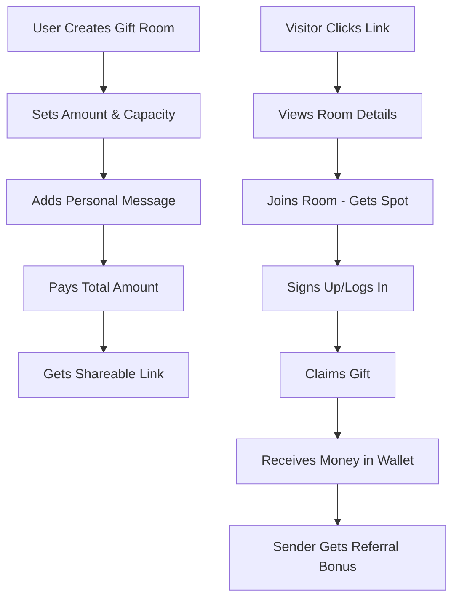

# TADA VTU - Gift Rooms System Design

## Overview

The Gift Rooms system is an interactive gift-sharing platform that allows users to create "rooms" where multiple people can join and claim gifts. This gamified approach to gift-giving drives user engagement and acquisition through social sharing.

## System Architecture

```
┌─────────────────┐    ┌─────────────────┐    ┌─────────────────┐
│   Frontend UI   │    │   Backend APIs  │    │   Database      │
│                 │    │                 │    │                 │
│ • Create Room   │◄──►│ • Gift Rooms    │◄──►│ • gift_rooms    │
│ • Join Room     │    │ • Reservations  │    │ • reservations  │
│ • Claim Gift    │    │ • Claims        │    │ • gift_claims   │
│ • Share Room    │    │ • Activities    │    │ • activities    │
└─────────────────┘    └─────────────────┘    └─────────────────┘
                              │
                              ▼
                       ┌─────────────────┐
                       │   Real-time     │
                       │                 │
                       │ • WebSocket     │
                       │ • Push Notifs   │
                       │ • Analytics     │
                       └─────────────────┘
```

## Core Features

### 1. Gift Room Types

| Type | Capacity | Use Case | Expiry | Target Audience |
|------|----------|----------|--------|-----------------|
| **Personal** | 1 | Direct gift to one person | 48 hours | Close friends/family |
| **Group** | 2-50 | Friends, family, colleagues | 48 hours | Known groups |
| **Public** | 1-1000 | Social media giveaways | 24 hours | Viral marketing |

### 2. User Journey



### 3. Key Mechanics

#### Room Creation
- **Upfront Payment**: Creator pays full amount (capacity × gift amount)
- **Instant Deduction**: Money deducted from wallet immediately
- **Refund System**: Unclaimed gifts refunded after expiry

#### Joining Process
- **Device Fingerprinting**: Prevents multiple claims per device
- **Reservation System**: Secures spot before signup
- **Contact Collection**: Optional email/phone for follow-up

#### Claiming Process
- **Authentication Required**: Must sign up/login to claim
- **Instant Credit**: Money added to wallet immediately
- **Referral Bonus**: Creator gets ₦100 for each new user

## Database Schema

### gift_rooms
```sql
CREATE TABLE gift_rooms (
  id UUID PRIMARY KEY,
  sender_id UUID REFERENCES profiles(id),
  type TEXT CHECK (type IN ('personal', 'group', 'public')),
  capacity INTEGER CHECK (capacity > 0),
  amount DECIMAL(12,2) CHECK (amount > 0),
  total_amount DECIMAL(12,2) CHECK (total_amount = capacity * amount),
  message TEXT,
  token TEXT UNIQUE NOT NULL,
  status TEXT DEFAULT 'active', -- 'active', 'full', 'expired', 'completed'
  joined_count INTEGER DEFAULT 0,
  claimed_count INTEGER DEFAULT 0,
  metadata JSONB DEFAULT '{}',
  created_at TIMESTAMPTZ DEFAULT NOW(),
  expires_at TIMESTAMPTZ NOT NULL,
  updated_at TIMESTAMPTZ DEFAULT NOW(),
  
  -- Business rule constraints
  CONSTRAINT check_capacity_limits CHECK (
    (type = 'personal' AND capacity = 1) OR
    (type = 'group' AND capacity BETWEEN 2 AND 50) OR
    (type = 'public' AND capacity <= 1000)
  ),
  CONSTRAINT check_counts CHECK (claimed_count <= joined_count AND joined_count <= capacity)
);
```

### reservations
```sql
CREATE TABLE reservations (
  id UUID PRIMARY KEY,
  room_id UUID REFERENCES gift_rooms(id),
  device_fingerprint TEXT NOT NULL,
  temp_token TEXT UNIQUE NOT NULL,
  status TEXT DEFAULT 'active', -- 'active', 'claimed', 'expired'
  contact_info JSONB, -- {email, phone, name}
  user_id UUID REFERENCES profiles(id),
  created_at TIMESTAMPTZ DEFAULT NOW(),
  expires_at TIMESTAMPTZ NOT NULL,
  claimed_at TIMESTAMPTZ,
  
  -- One reservation per device per room
  UNIQUE(room_id, device_fingerprint)
);
```

### gift_claims
```sql
CREATE TABLE gift_claims (
  id UUID PRIMARY KEY,
  reservation_id UUID REFERENCES reservations(id),
  user_id UUID REFERENCES profiles(id),
  amount DECIMAL(12,2) NOT NULL,
  transaction_id UUID REFERENCES transactions(id),
  referral_bonus_awarded BOOLEAN DEFAULT false,
  claimed_at TIMESTAMPTZ DEFAULT NOW(),
  
  -- One claim per reservation
  UNIQUE(reservation_id)
);
```

## API Endpoints

### Core Operations
| Endpoint | Method | Purpose | Auth Required |
|----------|--------|---------|---------------|
| `/api/gift-rooms/create` | POST | Create new gift room | ✅ |
| `/api/gift-rooms/[token]` | GET | Get room details | ❌ |
| `/api/gift-rooms/join` | POST | Join room (create reservation) | ❌ |
| `/api/gift-rooms/claim` | POST | Claim gift from reservation | ✅ |
| `/api/gift-rooms/my-rooms` | GET | List user's created rooms | ✅ |
| `/api/gift-rooms/history` | GET | User's claim history | ✅ |
| `/api/gift-rooms/stats` | GET | Room statistics | ✅ |

### Management Operations
| Endpoint | Method | Purpose | Auth Required |
|----------|--------|---------|---------------|
| `/api/gift-rooms/cleanup` | POST | Clean expired rooms (cron) | ❌ |
| `/api/gift-rooms/health` | GET | System health check | ❌ |
| `/api/gift-rooms/[token]/reservation` | GET | Check existing reservation | ❌ |

## Frontend Pages

### 1. Create Gift Room (`/dashboard/send-gift`)
- **Gift Type Selection**: Personal, Group, or Public
- **Amount Configuration**: Per-person gift amount
- **Capacity Setting**: Number of recipients
- **Personal Message**: Optional message for recipients
- **Expiry Settings**: Room duration (24-48 hours)
- **Payment Flow**: Instant wallet deduction
- **Share Options**: Copy link, social media, QR code

### 2. Manage Gift Rooms (`/dashboard/gift-rooms`)
- **Room List**: All created rooms with status
- **Filter Options**: Active, Full, Expired, Completed
- **Room Statistics**: Joined/claimed counts, time remaining
- **Share Actions**: Re-share room links
- **Analytics**: Click tracking, conversion rates

### 3. Public Gift Page (`/gift/[token]`)
- **Room Details**: Amount, message, spots remaining
- **Join Flow**: Device fingerprinting, contact collection
- **Signup Integration**: Seamless account creation
- **Claim Process**: Instant wallet credit
- **Social Sharing**: Encourage viral spread

## Business Logic

### Validation Rules

#### Gift Amounts
- **Minimum**: ₦50 per gift
- **Maximum**: ₦50,000 per gift
- **Total Limit**: ₦50,000,000 per room (1000 × ₦50,000)

#### Capacity Limits
```typescript
const GIFT_ROOM_LIMITS = {
  personal: { min: 1, max: 1 },
  group: { min: 2, max: 50 },
  public: { min: 1, max: 1000 }
};
```

#### Expiry Rules
```typescript
const EXPIRY_HOURS = {
  personal: 48,    // 2 days
  group: 48,       // 2 days  
  public: 24,      // 1 day
  reservation: 6   // 6 hours for public, 48 for others
};
```

### Anti-Fraud Measures

#### Device Fingerprinting
```typescript
interface DeviceFingerprint {
  userAgent: string;
  screenResolution: string;
  timezone: string;
  language: string;
  platform: string;
  hash: string; // SHA-256 of combined properties
}
```

#### Rate Limiting
- **Room Creation**: 10 rooms per hour per user
- **Join Attempts**: 5 joins per minute per device
- **Claim Attempts**: 3 claims per minute per user

#### Security Checks
- **Self-Claiming Prevention**: Creator cannot claim own gifts
- **Duplicate Prevention**: One reservation per device per room
- **Balance Verification**: Atomic wallet operations
- **Token Validation**: Secure random tokens for all operations

## Database Functions

### create_gift_room
```sql
CREATE OR REPLACE FUNCTION create_gift_room(
  p_sender_id UUID,
  p_type TEXT,
  p_capacity INTEGER,
  p_amount DECIMAL,
  p_message TEXT DEFAULT NULL,
  p_expiration_hours INTEGER DEFAULT 48
) RETURNS UUID AS $$
DECLARE
  v_total_amount DECIMAL;
  v_room_id UUID;
  v_token TEXT;
  v_expires_at TIMESTAMPTZ;
BEGIN
  -- Calculate and validate total amount
  v_total_amount := p_capacity * p_amount;
  
  -- Check user balance atomically
  UPDATE profiles 
  SET balance = balance - v_total_amount 
  WHERE id = p_sender_id AND balance >= v_total_amount;
  
  IF NOT FOUND THEN
    RAISE EXCEPTION 'Insufficient balance. Required: ₦%', v_total_amount;
  END IF;
  
  -- Generate unique token and expiry
  v_token := encode(gen_random_bytes(16), 'hex');
  v_expires_at := NOW() + (p_expiration_hours || ' hours')::INTERVAL;
  
  -- Create gift room
  INSERT INTO gift_rooms (
    sender_id, type, capacity, amount, total_amount, 
    message, token, expires_at
  ) VALUES (
    p_sender_id, p_type, p_capacity, p_amount, v_total_amount,
    p_message, v_token, v_expires_at
  ) RETURNING id INTO v_room_id;
  
  -- Log creation activity
  INSERT INTO gift_room_activities (
    room_id, user_id, activity_type, details
  ) VALUES (
    v_room_id, p_sender_id, 'created', 
    jsonb_build_object('total_amount', v_total_amount, 'capacity', p_capacity)
  );
  
  RETURN v_room_id;
END;
$$ LANGUAGE plpgsql;
```

### create_reservation
```sql
CREATE OR REPLACE FUNCTION create_reservation(
  p_room_id UUID,
  p_device_fingerprint TEXT,
  p_contact_info JSONB DEFAULT NULL
) RETURNS UUID AS $$
DECLARE
  v_reservation_id UUID;
  v_temp_token TEXT;
  v_expires_at TIMESTAMPTZ;
  v_room_type TEXT;
BEGIN
  -- Validate room availability
  SELECT type INTO v_room_type
  FROM gift_rooms 
  WHERE id = p_room_id 
    AND status = 'active' 
    AND expires_at > NOW()
    AND joined_count < capacity;
  
  IF NOT FOUND THEN
    RAISE EXCEPTION 'Gift room is full or no longer active';
  END IF;
  
  -- Check for existing reservation
  IF EXISTS (
    SELECT 1 FROM reservations 
    WHERE room_id = p_room_id AND device_fingerprint = p_device_fingerprint
  ) THEN
    RAISE EXCEPTION 'Device already has a reservation in this room';
  END IF;
  
  -- Generate temp token and set expiry
  v_temp_token := encode(gen_random_bytes(12), 'hex');
  v_expires_at := CASE 
    WHEN v_room_type = 'public' THEN NOW() + INTERVAL '6 hours'
    ELSE NOW() + INTERVAL '48 hours'
  END;
  
  -- Create reservation
  INSERT INTO reservations (
    room_id, device_fingerprint, temp_token, 
    contact_info, expires_at
  ) VALUES (
    p_room_id, p_device_fingerprint, v_temp_token,
    p_contact_info, v_expires_at
  ) RETURNING id INTO v_reservation_id;
  
  -- Update room joined count and status
  UPDATE gift_rooms 
  SET joined_count = joined_count + 1,
      status = CASE 
        WHEN joined_count + 1 >= capacity THEN 'full'
        ELSE status
      END,
      updated_at = NOW()
  WHERE id = p_room_id;
  
  RETURN v_reservation_id;
END;
$$ LANGUAGE plpgsql;
```

### claim_gift
```sql
CREATE OR REPLACE FUNCTION claim_gift(
  p_reservation_id UUID,
  p_user_id UUID
) RETURNS UUID AS $$
DECLARE
  v_claim_id UUID;
  v_amount DECIMAL;
  v_room_id UUID;
  v_sender_id UUID;
  v_referral_bonus BOOLEAN := false;
  v_transaction_id UUID;
BEGIN
  -- Get reservation and room details
  SELECT r.room_id, gr.amount, gr.sender_id
  INTO v_room_id, v_amount, v_sender_id
  FROM reservations r
  JOIN gift_rooms gr ON r.room_id = gr.id
  WHERE r.id = p_reservation_id 
    AND r.status = 'active'
    AND r.expires_at > NOW();
  
  IF NOT FOUND THEN
    RAISE EXCEPTION 'Reservation not found or expired';
  END IF;
  
  -- Prevent self-claiming
  IF v_sender_id = p_user_id THEN
    RAISE EXCEPTION 'Cannot claim your own gift';
  END IF;
  
  -- Check for duplicate claims
  IF EXISTS (SELECT 1 FROM gift_claims WHERE reservation_id = p_reservation_id) THEN
    RAISE EXCEPTION 'Gift already claimed';
  END IF;
  
  -- Credit user wallet
  UPDATE profiles 
  SET balance = balance + v_amount 
  WHERE id = p_user_id;
  
  -- Create transaction record
  INSERT INTO transactions (
    user_id, type, amount, status, description, reference
  ) VALUES (
    p_user_id, 'deposit', v_amount, 'success', 
    'Gift room claim', 'GIFT_CLAIM_' || p_reservation_id
  ) RETURNING id INTO v_transaction_id;
  
  -- Check for referral bonus (first-time user)
  SELECT 
    referred_by IS NOT NULL AND NOT EXISTS (
      SELECT 1 FROM gift_claims WHERE user_id = p_user_id
    ) 
  INTO v_referral_bonus
  FROM profiles WHERE id = p_user_id;
  
  -- Award referral bonus
  IF v_referral_bonus THEN
    UPDATE profiles 
    SET balance = balance + 100 
    WHERE id = (SELECT referred_by FROM profiles WHERE id = p_user_id);
    
    -- Create referral transaction
    INSERT INTO transactions (
      user_id, type, amount, status, description, reference
    ) VALUES (
      (SELECT referred_by FROM profiles WHERE id = p_user_id),
      'deposit', 100, 'success', 
      'Referral bonus - gift claim', 'REF_BONUS_' || p_user_id
    );
  END IF;
  
  -- Create claim record
  INSERT INTO gift_claims (
    reservation_id, user_id, amount, transaction_id, referral_bonus_awarded
  ) VALUES (
    p_reservation_id, p_user_id, v_amount, v_transaction_id, v_referral_bonus
  ) RETURNING id INTO v_claim_id;
  
  -- Update reservation status
  UPDATE reservations 
  SET status = 'claimed', user_id = p_user_id, claimed_at = NOW()
  WHERE id = p_reservation_id;
  
  -- Update room claimed count and status
  UPDATE gift_rooms 
  SET claimed_count = claimed_count + 1,
      status = CASE 
        WHEN claimed_count + 1 = capacity THEN 'completed'
        ELSE status
      END,
      updated_at = NOW()
  WHERE id = v_room_id;
  
  RETURN v_claim_id;
END;
$$ LANGUAGE plpgsql;
```

## Real-time Features

### WebSocket Integration
```typescript
// Subscribe to room updates
const subscribeToRoom = (roomId: string, onUpdate: () => void) => {
  const supabase = createClient();
  
  const channel = supabase
    .channel(`room-${roomId}`)
    .on('postgres_changes', {
      event: '*',
      schema: 'public',
      table: 'gift_rooms',
      filter: `id=eq.${roomId}`,
    }, onUpdate)
    .subscribe();
    
  return () => supabase.removeChannel(channel);
};
```

### Live Updates
- **Participant Count**: Real-time joined/claimed counters
- **Status Changes**: Active → Full → Completed transitions
- **Time Remaining**: Live countdown timers
- **New Claims**: Instant notifications for creators

## Cron Jobs & Maintenance

### Expired Room Cleanup
```sql
CREATE OR REPLACE FUNCTION cleanup_expired_gift_rooms()
RETURNS INTEGER AS $$
DECLARE
  v_refunded_count INTEGER := 0;
  v_room RECORD;
BEGIN
  -- Process expired rooms
  FOR v_room IN 
    SELECT id, sender_id, capacity, amount, claimed_count
    FROM gift_rooms 
    WHERE status IN ('active', 'full') 
      AND expires_at < NOW()
  LOOP
    DECLARE
      v_unclaimed_count INTEGER;
      v_refund_amount DECIMAL;
    BEGIN
      -- Calculate refund
      v_unclaimed_count := v_room.capacity - v_room.claimed_count;
      v_refund_amount := v_unclaimed_count * v_room.amount;
      
      -- Refund unclaimed gifts
      IF v_refund_amount > 0 THEN
        UPDATE profiles 
        SET balance = balance + v_refund_amount 
        WHERE id = v_room.sender_id;
        
        -- Create refund transaction
        INSERT INTO transactions (
          user_id, type, amount, status, description, reference
        ) VALUES (
          v_room.sender_id, 'deposit', v_refund_amount, 'success',
          'Gift room refund', 'REFUND_' || v_room.id
        );
        
        v_refunded_count := v_refunded_count + 1;
      END IF;
      
      -- Mark room as expired
      UPDATE gift_rooms 
      SET status = 'expired', updated_at = NOW()
      WHERE id = v_room.id;
      
      -- Log expiry activity
      INSERT INTO gift_room_activities (
        room_id, activity_type, details
      ) VALUES (
        v_room.id, 'expired',
        jsonb_build_object('refund_amount', v_refund_amount)
      );
    END;
  END LOOP;
  
  -- Clean up expired reservations
  UPDATE reservations 
  SET status = 'expired' 
  WHERE status = 'active' AND expires_at < NOW();
  
  RETURN v_refunded_count;
END;
$$ LANGUAGE plpgsql;
```

### Cron Schedule
```typescript
// /api/cron/process-gifts/route.ts
export async function GET() {
  const { data: refundedCount } = await supabase
    .rpc('cleanup_expired_gift_rooms');
  
  return NextResponse.json({
    success: true,
    refunded_rooms: refundedCount,
    timestamp: new Date().toISOString()
  });
}
```

## Analytics & Metrics

### Key Performance Indicators
- **Room Creation Rate**: Rooms created per day/week
- **Join Rate**: Visitors who join vs bounce
- **Claim Rate**: Reservations that convert to claims
- **Viral Coefficient**: Average shares per room
- **Referral Impact**: New users acquired via gift rooms

### Tracking Events
```typescript
// Analytics events to track
const EVENTS = {
  ROOM_CREATED: 'gift_room_created',
  ROOM_SHARED: 'gift_room_shared', 
  ROOM_JOINED: 'gift_room_joined',
  GIFT_CLAIMED: 'gift_claimed',
  REFERRAL_EARNED: 'referral_bonus_earned'
};
```

## Error Handling

### Common Error Scenarios
1. **Insufficient Balance**: Clear message with current balance
2. **Room Full**: Show alternative rooms or suggest creating own
3. **Expired Room**: Explain expiry and suggest alternatives
4. **Device Already Joined**: Clear explanation of one-per-device rule
5. **Network Issues**: Retry mechanisms with exponential backoff

### User-Friendly Messages
```typescript
const ERROR_MESSAGES = {
  INSUFFICIENT_BALANCE: "You need ₦{amount} but have ₦{balance}. Fund your wallet to continue.",
  ROOM_FULL: "This gift room is full! Try creating your own or look for other active rooms.",
  ROOM_EXPIRED: "This gift room has expired. The creator has been refunded for unclaimed gifts.",
  ALREADY_JOINED: "You've already secured a spot in this room. Complete signup to claim your gift.",
  SELF_CLAIM: "You can't claim your own gift! Share the link with others instead."
};
```

## Security Considerations

### Data Protection
- **PII Handling**: Minimal collection, secure storage
- **Token Security**: Cryptographically secure random tokens
- **Rate Limiting**: Prevent abuse and spam
- **Input Validation**: Comprehensive validation on all inputs

### Fraud Prevention
- **Device Fingerprinting**: Prevent multi-claiming
- **IP Tracking**: Monitor suspicious patterns
- **Velocity Checks**: Detect unusual activity
- **Manual Review**: Flag high-value or suspicious rooms

## Performance Optimization

### Database Optimization
- **Indexes**: Optimized for common query patterns
- **Partitioning**: Consider partitioning large tables by date
- **Connection Pooling**: Efficient database connections
- **Query Optimization**: Minimize N+1 queries

### Frontend Optimization
- **Code Splitting**: Load only necessary code
- **Image Optimization**: Optimized images and icons
- **Caching**: Strategic caching of static content
- **Progressive Loading**: Skeleton screens and lazy loading

---

## Summary

The Gift Rooms system provides an engaging, social way to share gifts that:

✅ **Drives User Acquisition**: Referral bonuses incentivize sharing  
✅ **Increases Engagement**: Gamified gift-claiming experience  
✅ **Builds Community**: Social sharing creates viral loops  
✅ **Generates Revenue**: Transaction volume and user growth  
✅ **Prevents Fraud**: Comprehensive anti-abuse measures  
✅ **Scales Efficiently**: Optimized for high-volume usage  

This focused approach eliminates the complexity of direct gift sending while maximizing the viral and engagement potential of the gift-sharing experience.