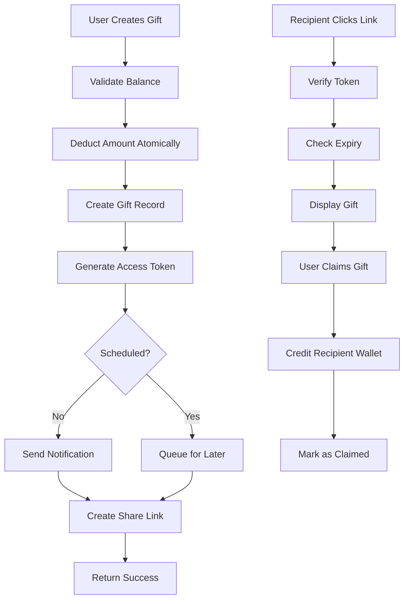
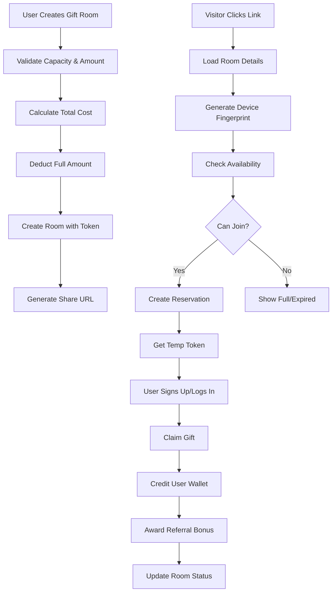

# TADA VTU - Gift System Design

## Overview

The TADA VTU Gift System consists of two interconnected subsystems:
1. **Send Gift** - Traditional gift cards sent directly to recipients
2. **Gift Rooms** - Interactive gift-sharing experiences with multiple participants

Both systems enable users to share value with others while driving user acquisition and engagement.

## System Architecture

```
┌─────────────────┐    ┌─────────────────┐    ┌─────────────────┐
│   Frontend UI   │    │   Backend APIs  │    │   Database      │
│                 │    │                 │    │                 │
│ • Send Gift     │◄──►│ • Gift Cards    │◄──►│ • gift_cards    │
│ • Gift Rooms    │    │ • Gift Rooms    │    │ • gift_rooms    │
│ • Claim Pages   │    │ • Reservations  │    │ • reservations  │
│                 │    │ • Claims        │    │ • gift_claims   │
└─────────────────┘    └─────────────────┘    └─────────────────┘
                              │
                              ▼
                       ┌─────────────────┐
                       │   External      │
                       │                 │
                       │ • Email Service │
                       │ • SMS Service   │
                       │ • Push Notifs   │
                       └─────────────────┘
```

## 1. Send Gift System (Traditional Gift Cards)

### Core Features
- **Direct Gift Sending**: Send gifts to specific recipients via email/phone
- **Scheduled Delivery**: Schedule gifts for future delivery
- **Multiple Service Types**: Airtime, data, or wallet credit
- **Themed Cards**: Visual themes for different occasions
- **Personal Messages**: Custom messages with gifts

### Data Flow



### Database Schema

#### gift_cards
```sql
CREATE TABLE gift_cards (
  id UUID PRIMARY KEY,
  sender_id UUID REFERENCES profiles(id),
  sender_name TEXT NOT NULL,
  recipient_email TEXT NOT NULL,
  recipient_phone TEXT,
  recipient_user_id UUID REFERENCES profiles(id),
  service_type TEXT NOT NULL, -- 'airtime', 'data', 'wallet'
  amount DECIMAL(12,2) NOT NULL,
  network TEXT, -- For airtime/data gifts
  occasion TEXT NOT NULL,
  theme_id TEXT NOT NULL,
  personal_message TEXT,
  scheduled_delivery TIMESTAMPTZ,
  delivered_at TIMESTAMPTZ,
  claimed_at TIMESTAMPTZ,
  status TEXT DEFAULT 'delivered', -- 'scheduled', 'delivered', 'claimed', 'expired'
  expires_at TIMESTAMPTZ NOT NULL,
  access_token TEXT UNIQUE NOT NULL,
  created_at TIMESTAMPTZ DEFAULT NOW()
);
```

### API Endpoints

| Endpoint | Method | Purpose |
|----------|--------|---------|
| `/api/gifts/send` | POST | Create and send gift card |
| `/api/gifts/send` | GET | List user's sent gifts |
| `/api/gifts/[id]` | GET | Get gift details by ID |
| `/api/gifts/[id]/open` | POST | Claim gift (recipient) |
| `/api/gifts/[id]/cancel` | POST | Cancel unclaimed gift |

### Security Features
- **Access Tokens**: Secure 32-character tokens for gift access
- **Expiry Validation**: 7-day expiry from delivery date
- **Balance Verification**: Atomic balance deduction with rollback
- **Rate Limiting**: Prevent gift spam (5 gifts per minute)
- **Duplicate Prevention**: Check for existing gifts to same recipient

## 2. Gift Room System (Interactive Gift Sharing)

### Core Features
- **Multiple Gift Types**: Personal (1), Group (2-50), Public (up to 1000)
- **Reservation System**: Users reserve spots before claiming
- **Device Fingerprinting**: Prevent multiple claims per device
- **Real-time Updates**: Live participant counts and status
- **Referral Bonuses**: ₦100 bonus for each new user referred

### Gift Room Types

| Type | Capacity | Use Case | Expiry |
|------|----------|----------|--------|
| **Personal** | 1 | Direct gift to one person | 48 hours |
| **Group** | 2-50 | Friends, family, colleagues | 48 hours |
| **Public** | 1-1000 | Social media giveaways | 24 hours |

### Data Flow



### Database Schema

#### gift_rooms
```sql
CREATE TABLE gift_rooms (
  id UUID PRIMARY KEY,
  sender_id UUID REFERENCES profiles(id),
  type TEXT CHECK (type IN ('personal', 'group', 'public')),
  capacity INTEGER CHECK (capacity > 0),
  amount DECIMAL(12,2) CHECK (amount > 0),
  total_amount DECIMAL(12,2) CHECK (total_amount = capacity * amount),
  message TEXT,
  token TEXT UNIQUE NOT NULL,
  status TEXT DEFAULT 'active', -- 'active', 'full', 'expired', 'completed'
  joined_count INTEGER DEFAULT 0,
  claimed_count INTEGER DEFAULT 0,
  metadata JSONB DEFAULT '{}',
  created_at TIMESTAMPTZ DEFAULT NOW(),
  expires_at TIMESTAMPTZ NOT NULL,
  updated_at TIMESTAMPTZ DEFAULT NOW()
);
```

#### reservations
```sql
CREATE TABLE reservations (
  id UUID PRIMARY KEY,
  room_id UUID REFERENCES gift_rooms(id),
  device_fingerprint TEXT NOT NULL,
  temp_token TEXT UNIQUE NOT NULL,
  status TEXT DEFAULT 'active', -- 'active', 'claimed', 'expired'
  contact_info JSONB,
  user_id UUID REFERENCES profiles(id),
  created_at TIMESTAMPTZ DEFAULT NOW(),
  expires_at TIMESTAMPTZ NOT NULL,
  claimed_at TIMESTAMPTZ,
  UNIQUE(room_id, device_fingerprint)
);
```

#### gift_claims
```sql
CREATE TABLE gift_claims (
  id UUID PRIMARY KEY,
  reservation_id UUID REFERENCES reservations(id),
  user_id UUID REFERENCES profiles(id),
  amount DECIMAL(12,2) NOT NULL,
  transaction_id UUID REFERENCES transactions(id),
  referral_bonus_awarded BOOLEAN DEFAULT false,
  claimed_at TIMESTAMPTZ DEFAULT NOW(),
  UNIQUE(reservation_id)
);
```

### API Endpoints

| Endpoint | Method | Purpose |
|----------|--------|---------|
| `/api/gift-rooms/create` | POST | Create new gift room |
| `/api/gift-rooms/[token]` | GET | Get room details by token |
| `/api/gift-rooms/join` | POST | Join room (create reservation) |
| `/api/gift-rooms/claim` | POST | Claim gift from reservation |
| `/api/gift-rooms/my-rooms` | GET | List user's created rooms |
| `/api/gift-rooms/history` | GET | User's claim history |
| `/api/gift-rooms/stats` | GET | Room statistics |
| `/api/gift-rooms/cleanup` | POST | Clean expired rooms (cron) |

### Device Fingerprinting
```typescript
interface DeviceFingerprint {
  userAgent: string;
  screenResolution: string;
  timezone: string;
  language: string;
  platform: string;
  hash: string; // SHA-256 of combined properties
}
```

## 3. Frontend Components

### Component Architecture
```
src/
├── app/
│   ├── dashboard/
│   │   ├── send-gift/page.tsx          # Traditional gift creation
│   │   └── gift-rooms/page.tsx         # Gift room management
│   └── gift/
│       └── [token]/page.tsx            # Public gift claim page
├── components/
│   ├── gift-room-card.tsx              # Room display component
│   ├── gift-room-stats.tsx             # Analytics component
│   ├── gift-room-wizard.tsx            # Creation wizard
│   ├── gift-room-share.tsx             # Sharing component
│   └── share-gift-modal.tsx            # Traditional gift sharing
└── hooks/
    ├── useGiftRoom.ts                  # Gift room operations
    └── useVirtualAccount.ts            # Related wallet operations
```

### Key Components

#### GiftRoomCard
- Displays room status and progress
- Shows participant count and time remaining
- Provides share and view actions
- Real-time updates via WebSocket

#### GiftRoomWizard
- Step-by-step room creation
- Type selection and validation
- Amount and capacity configuration
- Message and expiry settings

#### ShareGiftModal
- Multiple sharing options (link, social, email)
- QR code generation
- Copy to clipboard functionality
- Analytics tracking

## 4. Business Logic

### Validation Rules

#### Gift Amounts
- **Minimum**: ₦50 per gift
- **Maximum**: ₦50,000 per gift
- **Balance Check**: User must have sufficient balance for total amount

#### Capacity Limits
- **Personal**: Exactly 1 recipient
- **Group**: 2-50 recipients
- **Public**: 1-1000 recipients

#### Expiry Rules
- **Gift Cards**: 7 days from delivery
- **Gift Rooms**: 24-48 hours based on type
- **Reservations**: 6-48 hours based on room type

### Referral System Integration
- **New User Bonus**: ₦100 to referrer when referred user claims first gift
- **Tracking**: Links gift claims to referral codes
- **Validation**: Prevents self-referral and duplicate bonuses

### Anti-Fraud Measures
- **Device Fingerprinting**: Prevents multiple claims per device
- **Rate Limiting**: Limits gift creation frequency
- **IP Tracking**: Logs all activities with IP addresses
- **Balance Verification**: Atomic transactions prevent double-spending

## 5. Database Functions

### create_gift_room
```sql
CREATE OR REPLACE FUNCTION create_gift_room(
  p_sender_id UUID,
  p_type TEXT,
  p_capacity INTEGER,
  p_amount DECIMAL,
  p_message TEXT DEFAULT NULL,
  p_expiration_hours INTEGER DEFAULT 48
) RETURNS UUID AS $$
DECLARE
  v_total_amount DECIMAL;
  v_room_id UUID;
  v_token TEXT;
  v_expires_at TIMESTAMPTZ;
BEGIN
  -- Calculate total amount
  v_total_amount := p_capacity * p_amount;
  
  -- Check user balance
  IF NOT EXISTS (
    SELECT 1 FROM profiles 
    WHERE id = p_sender_id AND balance >= v_total_amount
  ) THEN
    RAISE EXCEPTION 'Insufficient balance. Required: ₦%', v_total_amount;
  END IF;
  
  -- Generate unique token
  v_token := encode(gen_random_bytes(16), 'hex');
  v_expires_at := NOW() + (p_expiration_hours || ' hours')::INTERVAL;
  
  -- Deduct balance atomically
  UPDATE profiles 
  SET balance = balance - v_total_amount 
  WHERE id = p_sender_id AND balance >= v_total_amount;
  
  IF NOT FOUND THEN
    RAISE EXCEPTION 'Insufficient balance or concurrent modification';
  END IF;
  
  -- Create gift room
  INSERT INTO gift_rooms (
    sender_id, type, capacity, amount, total_amount, 
    message, token, expires_at
  ) VALUES (
    p_sender_id, p_type, p_capacity, p_amount, v_total_amount,
    p_message, v_token, v_expires_at
  ) RETURNING id INTO v_room_id;
  
  -- Log activity
  INSERT INTO gift_room_activities (
    room_id, user_id, activity_type, details
  ) VALUES (
    v_room_id, p_sender_id, 'created', 
    jsonb_build_object('total_amount', v_total_amount)
  );
  
  RETURN v_room_id;
END;
$$ LANGUAGE plpgsql;
```

### create_reservation
```sql
CREATE OR REPLACE FUNCTION create_reservation(
  p_room_id UUID,
  p_device_fingerprint TEXT,
  p_contact_info JSONB DEFAULT NULL
) RETURNS UUID AS $$
DECLARE
  v_reservation_id UUID;
  v_temp_token TEXT;
  v_expires_at TIMESTAMPTZ;
  v_room_type TEXT;
BEGIN
  -- Get room details and check availability
  SELECT type INTO v_room_type
  FROM gift_rooms 
  WHERE id = p_room_id 
    AND status = 'active' 
    AND expires_at > NOW()
    AND joined_count < capacity;
  
  IF NOT FOUND THEN
    RAISE EXCEPTION 'Gift room is full or no longer active';
  END IF;
  
  -- Check for existing reservation
  IF EXISTS (
    SELECT 1 FROM reservations 
    WHERE room_id = p_room_id AND device_fingerprint = p_device_fingerprint
  ) THEN
    RAISE EXCEPTION 'Device already has a reservation in this room';
  END IF;
  
  -- Generate temp token and set expiry
  v_temp_token := encode(gen_random_bytes(12), 'hex');
  v_expires_at := CASE 
    WHEN v_room_type = 'public' THEN NOW() + INTERVAL '6 hours'
    ELSE NOW() + INTERVAL '48 hours'
  END;
  
  -- Create reservation
  INSERT INTO reservations (
    room_id, device_fingerprint, temp_token, 
    contact_info, expires_at
  ) VALUES (
    p_room_id, p_device_fingerprint, v_temp_token,
    p_contact_info, v_expires_at
  ) RETURNING id INTO v_reservation_id;
  
  -- Update room joined count
  UPDATE gift_rooms 
  SET joined_count = joined_count + 1,
      status = CASE 
        WHEN joined_count + 1 >= capacity THEN 'full'
        ELSE status
      END
  WHERE id = p_room_id;
  
  RETURN v_reservation_id;
END;
$$ LANGUAGE plpgsql;
```

### claim_gift
```sql
CREATE OR REPLACE FUNCTION claim_gift(
  p_reservation_id UUID,
  p_user_id UUID
) RETURNS UUID AS $$
DECLARE
  v_claim_id UUID;
  v_amount DECIMAL;
  v_room_id UUID;
  v_sender_id UUID;
  v_referral_bonus BOOLEAN := false;
BEGIN
  -- Get reservation and room details
  SELECT r.room_id, gr.amount, gr.sender_id
  INTO v_room_id, v_amount, v_sender_id
  FROM reservations r
  JOIN gift_rooms gr ON r.room_id = gr.id
  WHERE r.id = p_reservation_id 
    AND r.status = 'active'
    AND r.expires_at > NOW();
  
  IF NOT FOUND THEN
    RAISE EXCEPTION 'Reservation not found or no longer active';
  END IF;
  
  -- Prevent self-claiming
  IF v_sender_id = p_user_id THEN
    RAISE EXCEPTION 'Cannot claim your own gift';
  END IF;
  
  -- Check if already claimed
  IF EXISTS (SELECT 1 FROM gift_claims WHERE reservation_id = p_reservation_id) THEN
    RAISE EXCEPTION 'Gift already claimed';
  END IF;
  
  -- Credit user wallet
  UPDATE profiles 
  SET balance = balance + v_amount 
  WHERE id = p_user_id;
  
  -- Check for referral bonus (first-time user)
  SELECT referred_by IS NOT NULL AND NOT EXISTS (
    SELECT 1 FROM gift_claims WHERE user_id = p_user_id
  ) INTO v_referral_bonus
  FROM profiles WHERE id = p_user_id;
  
  -- Award referral bonus if applicable
  IF v_referral_bonus THEN
    UPDATE profiles 
    SET balance = balance + 100 
    WHERE id = (SELECT referred_by FROM profiles WHERE id = p_user_id);
  END IF;
  
  -- Create claim record
  INSERT INTO gift_claims (
    reservation_id, user_id, amount, referral_bonus_awarded
  ) VALUES (
    p_reservation_id, p_user_id, v_amount, v_referral_bonus
  ) RETURNING id INTO v_claim_id;
  
  -- Update reservation status
  UPDATE reservations 
  SET status = 'claimed', user_id = p_user_id, claimed_at = NOW()
  WHERE id = p_reservation_id;
  
  -- Update room claimed count
  UPDATE gift_rooms 
  SET claimed_count = claimed_count + 1,
      status = CASE 
        WHEN claimed_count + 1 = capacity THEN 'completed'
        ELSE status
      END
  WHERE id = v_room_id;
  
  RETURN v_claim_id;
END;
$$ LANGUAGE plpgsql;
```

## 6. Cron Jobs & Cleanup

### Expired Room Cleanup
```sql
-- Function to clean up expired gift rooms
CREATE OR REPLACE FUNCTION cleanup_expired_gift_rooms()
RETURNS INTEGER AS $$
DECLARE
  v_refunded_count INTEGER := 0;
  v_room RECORD;
BEGIN
  -- Process expired rooms
  FOR v_room IN 
    SELECT id, sender_id, total_amount, claimed_count, amount
    FROM gift_rooms 
    WHERE status IN ('active', 'full') 
      AND expires_at < NOW()
  LOOP
    -- Calculate refund amount (unclaimed gifts)
    DECLARE
      v_unclaimed_count INTEGER;
      v_refund_amount DECIMAL;
    BEGIN
      v_unclaimed_count := v_room.capacity - v_room.claimed_count;
      v_refund_amount := v_unclaimed_count * v_room.amount;
      
      -- Refund unclaimed amount
      IF v_refund_amount > 0 THEN
        UPDATE profiles 
        SET balance = balance + v_refund_amount 
        WHERE id = v_room.sender_id;
        
        v_refunded_count := v_refunded_count + 1;
      END IF;
      
      -- Mark room as expired
      UPDATE gift_rooms 
      SET status = 'expired' 
      WHERE id = v_room.id;
      
      -- Log activity
      INSERT INTO gift_room_activities (
        room_id, activity_type, details
      ) VALUES (
        v_room.id, 'expired',
        jsonb_build_object('refund_amount', v_refund_amount)
      );
    END;
  END LOOP;
  
  -- Clean up expired reservations
  UPDATE reservations 
  SET status = 'expired' 
  WHERE status = 'active' AND expires_at < NOW();
  
  RETURN v_refunded_count;
END;
$$ LANGUAGE plpgsql;
```

### Cron Endpoint
```typescript
// /api/cron/process-gifts/route.ts
export async function GET() {
  const { data: result } = await supabase
    .rpc('cleanup_expired_gift_rooms');
  
  return NextResponse.json({
    success: true,
    processed: result,
    timestamp: new Date().toISOString()
  });
}
```

## 7. Security & Performance

### Security Measures
- **Row Level Security**: Database-level access control
- **Token Validation**: Secure access tokens for all operations
- **Rate Limiting**: Prevent abuse and spam
- **Input Validation**: Zod schemas for all inputs
- **Atomic Transactions**: Prevent race conditions
- **Device Fingerprinting**: Anti-fraud protection

### Performance Optimizations
- **Database Indexes**: Optimized queries for all operations
- **Connection Pooling**: Efficient database connections
- **Caching**: Redis for frequently accessed data
- **Real-time Updates**: WebSocket for live updates
- **Lazy Loading**: Progressive data loading

### Monitoring & Analytics
- **Activity Logging**: Complete audit trail
- **Performance Metrics**: Response times and success rates
- **Business Metrics**: Gift creation, claim rates, referral bonuses
- **Error Tracking**: Comprehensive error logging

## 8. Integration Points

### Wallet System
- **Balance Deduction**: Atomic operations with rollback
- **Credit Operations**: Instant wallet credits for claims
- **Transaction Records**: Complete transaction history

### Referral System
- **Bonus Awards**: ₦100 for each successful referral
- **Tracking**: Links claims to referral codes
- **Validation**: Prevents duplicate bonuses

### Notification System
- **Email Notifications**: Gift delivery and claim notifications
- **Push Notifications**: Real-time updates for mobile users
- **SMS Notifications**: Optional SMS for important events

### Analytics System
- **Event Tracking**: User actions and conversions
- **Funnel Analysis**: Gift creation to claim conversion
- **Revenue Tracking**: Gift volume and referral impact

## 9. Error Handling & Recovery

### Graceful Degradation
- **Service Failures**: Fallback mechanisms for external services
- **Database Issues**: Retry logic with exponential backoff
- **Network Problems**: Offline capability where possible

### Data Consistency
- **Atomic Operations**: All money movements are atomic
- **Rollback Mechanisms**: Automatic rollback on failures
- **Reconciliation**: Daily reconciliation processes

### User Experience
- **Clear Error Messages**: User-friendly error descriptions
- **Recovery Options**: Clear paths to resolve issues
- **Support Integration**: Easy access to help when needed

## 10. Future Enhancements

### Planned Features
- **Gift Scheduling**: Advanced scheduling options
- **Gift Templates**: Pre-designed gift templates
- **Bulk Gifts**: Send multiple gifts at once
- **Gift Analytics**: Detailed analytics for senders
- **Social Integration**: Direct social media sharing

### Scalability Improvements
- **Microservices**: Split into focused services
- **Event Sourcing**: Event-driven architecture
- **Caching Layer**: Redis for high-performance caching
- **CDN Integration**: Global content delivery

---

## Summary

The TADA VTU Gift System provides a comprehensive solution for digital gift sharing with two complementary approaches:

✅ **Traditional Gifts**: Direct, personal gift cards with scheduling  
✅ **Interactive Rooms**: Social gift-sharing experiences  
✅ **Referral Integration**: Built-in user acquisition mechanism  
✅ **Security First**: Comprehensive fraud prevention  
✅ **Scalable Architecture**: Designed for growth  
✅ **Real-time Updates**: Live participant tracking  
✅ **Mobile Optimized**: Progressive web app experience  

The system drives user engagement, acquisition, and retention while providing a delightful gift-sharing experience that differentiates TADA VTU in the Nigerian fintech market.