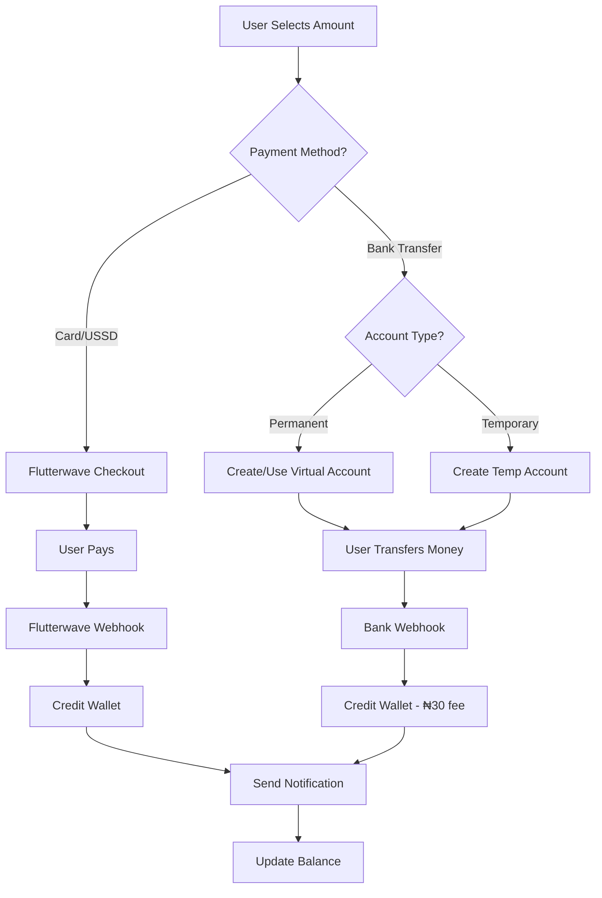
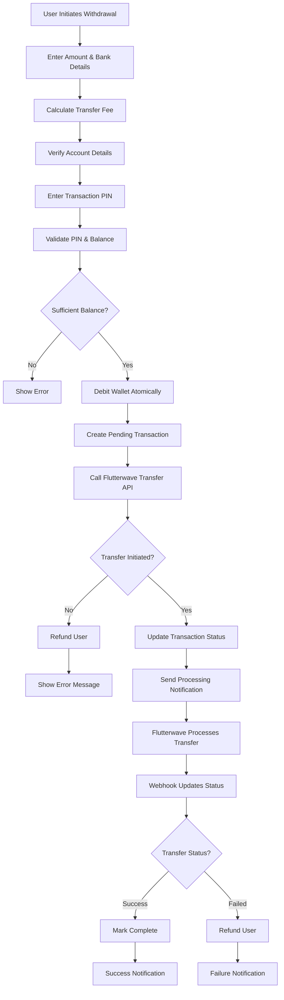

# TADA VTU - Wallet System Design

## Overview

The TADA VTU wallet system handles all money flows in and out of user accounts through a secure, atomic, and fault-tolerant architecture. The system is built on Flutterwave's payment infrastructure with comprehensive error handling and automatic recovery mechanisms.

## System Architecture

```
┌─────────────────┐    ┌─────────────────┐    ┌─────────────────┐
│   User Frontend │    │   TADA Backend  │    │   Flutterwave   │
│                 │    │                 │    │                 │
│ • Fund Wallet   │◄──►│ • API Routes    │◄──►│ • Payment API   │
│ • Withdraw      │    │ • Webhooks      │    │ • Transfer API  │
│ • Transactions  │    │ • Database      │    │ • Virtual Accts │
└─────────────────┘    └─────────────────┘    └─────────────────┘
                              │
                              ▼
                       ┌─────────────────┐
                       │   Supabase DB   │
                       │                 │
                       │ • User Profiles │
                       │ • Transactions  │
                       │ • Withdrawals   │
                       │ • Virtual Accts │
                       └─────────────────┘
```

## Fund Wallet System (Money IN)

### Payment Methods

#### 1. Card/USSD Payment
- **Flow**: User → Flutterwave Checkout → Webhook → Wallet Credit
- **Fee**: ~1.4% (dynamic, calculated by Flutterwave)
- **Processing**: Real-time via webhook
- **Supported**: Cards, Bank Transfer, USSD, QR Code

#### 2. Bank Transfer (Virtual Accounts)
- **Flow**: User → Virtual Account → Bank Transfer → Webhook → Wallet Credit
- **Fee**: ₦30 flat fee (deducted from transfer amount)
- **Types**: Permanent (requires BVN) or Temporary (1-hour expiry)

### Fund Wallet Flow



### Virtual Account System

#### Permanent Virtual Accounts
- **Requirement**: BVN verification
- **Lifespan**: Permanent (reusable)
- **Usage**: Any amount, anytime
- **Creation**: `/api/flutterwave/virtual-account` (POST)

#### Temporary Virtual Accounts  
- **Requirement**: No BVN needed
- **Lifespan**: 1 hour expiry
- **Usage**: Specific amount only
- **Creation**: `/api/flutterwave/virtual-account` (POST with amount)

### Fee Structure (Fund Wallet)

| Method | Fee | Calculation |
|--------|-----|-------------|
| Card Payment | ~1.4% | Dynamic (Flutterwave) |
| Bank Transfer | ₦30 | Flat fee (deducted from transfer) |
| USSD | ~1.4% | Dynamic (Flutterwave) |

## Withdrawal System (Money OUT)

### Withdrawal Flow



### Withdrawal Security

1. **PIN Verification**: 4-digit transaction PIN required
2. **Balance Check**: Amount + fee must be available
3. **Atomic Operations**: Wallet debited before API call
4. **Auto-Refund**: Failed transfers automatically refunded
5. **Rate Limiting**: Prevents abuse

### Fee Structure (Withdrawal)

| Amount Range | Fee |
|--------------|-----|
| ₦100 - ₦5,000 | ₦10 |
| ₦5,001 - ₦50,000 | ₦25 |
| ₦50,001+ | ₦50 |

## Database Schema

### Core Tables

#### profiles
```sql
- id (uuid, primary key)
- balance (decimal(12,2), default 0)
- pin (text, hashed)
- referred_by (uuid, foreign key)
- created_at (timestamp)
```

#### transactions
```sql
- id (uuid, primary key)
- user_id (uuid, foreign key)
- type (enum: deposit, withdrawal, purchase)
- amount (decimal(12,2))
- status (enum: pending, success, failed)
- description (text)
- reference (text, unique)
- external_reference (text)
- response_data (jsonb)
- created_at (timestamp)
```

#### withdrawals
```sql
- id (uuid, primary key)
- user_id (uuid, foreign key)
- amount (decimal(12,2))
- fee (decimal(12,2))
- bank_code (text)
- account_number (text)
- account_name (text)
- reference (text, unique)
- status (enum: pending, success, failed)
- failure_reason (text)
- completed_at (timestamp)
- created_at (timestamp)
```

#### virtual_accounts
```sql
- id (uuid, primary key)
- user_id (uuid, foreign key)
- account_number (text, unique)
- bank_name (text)
- account_name (text)
- order_ref (text)
- flw_ref (text)
- is_active (boolean, default true)
- is_temporary (boolean, default false)
- amount (decimal(12,2)) -- for temp accounts
- expiry_date (timestamp) -- for temp accounts
- created_at (timestamp)
```

## API Endpoints

### Fund Wallet APIs

| Endpoint | Method | Purpose |
|----------|--------|---------|
| `/api/flutterwave/virtual-account` | GET | Fetch user's virtual account |
| `/api/flutterwave/virtual-account` | POST | Create virtual account |
| `/api/flutterwave/fee-check` | POST | Calculate payment fees |
| `/api/flutterwave/webhook` | POST | Process payment webhooks |

### Withdrawal APIs

| Endpoint | Method | Purpose |
|----------|--------|---------|
| `/api/withdrawal/banks` | GET | List Nigerian banks |
| `/api/withdrawal/verify-account` | POST | Verify bank account |
| `/api/withdrawal/transfer` | POST | Initiate withdrawal |
| `/api/flutterwave/fee-check` | POST | Calculate transfer fees |

## Webhook Processing

### Flutterwave Webhook Events

#### charge.completed (Deposits)
```javascript
// Card/USSD payments
if (data.payment_type !== 'bank_transfer') {
  const walletCredit = data.meta.wallet_credit;
  // Credit user wallet
  // Create transaction record
  // Send notification
  // Handle referral bonus (first deposit)
}

// Bank transfers to virtual accounts
if (data.payment_type === 'bank_transfer') {
  const transferAmount = data.amount;
  const walletCredit = transferAmount - BANK_TRANSFER_FEE; // ₦30
  // Credit user wallet (minus fee)
  // Create transaction record
  // Send notification
}
```

#### transfer.completed (Withdrawals)
```javascript
if (data.status === 'SUCCESSFUL') {
  // Mark withdrawal as complete
  // Update transaction status
  // Send success notification
} else if (data.status === 'FAILED') {
  // Refund user (amount + fee)
  // Mark withdrawal as failed
  // Send failure notification
}
```

## Error Handling & Recovery

### Atomic Operations
1. **Wallet Debits**: Always debit before external API calls
2. **Auto-Refund**: Failed operations automatically refund users
3. **Transaction Logging**: All operations logged with references
4. **Idempotency**: Webhooks handle duplicate events gracefully

### Failure Scenarios

#### Fund Wallet Failures
- **Webhook Timeout**: Manual reconciliation via admin panel
- **Duplicate Webhooks**: Prevented by reference checking
- **Invalid User**: Webhook returns error, payment refunded by Flutterwave

#### Withdrawal Failures
- **API Timeout**: User refunded, can retry
- **Insufficient Funds**: Prevented by balance check
- **Invalid Account**: Caught during verification step
- **Transfer Failed**: Webhook triggers automatic refund

## Security Measures

### Authentication & Authorization
- **JWT Tokens**: Supabase auth for API access
- **Row Level Security**: Database-level access control
- **PIN Verification**: Required for withdrawals
- **Rate Limiting**: Prevents abuse and brute force

### Data Protection
- **PIN Hashing**: Transaction PINs hashed with salt
- **Webhook Signatures**: Flutterwave signature verification
- **HTTPS Only**: All communications encrypted
- **Input Validation**: Zod schemas for all inputs

## User Experience

### Fund Wallet UX
1. **Payment Method Selection**: Card vs Bank Transfer
2. **Fee Transparency**: Clear fee display before payment
3. **Real-time Updates**: Balance updates immediately
4. **Multiple Options**: Quick amounts + custom input
5. **Account Management**: Permanent vs temporary accounts

### Withdrawal UX
1. **Progressive Disclosure**: Step-by-step wizard
2. **Account Verification**: Real-time account name lookup
3. **Fee Calculation**: Dynamic fee display
4. **Status Updates**: Real-time withdrawal status
5. **Error Recovery**: Clear error messages with retry options

## Monitoring & Logging

### Key Metrics
- **Success Rates**: Fund/withdrawal success percentages
- **Processing Times**: Average time for operations
- **Fee Revenue**: Total fees collected
- **User Adoption**: Virtual account creation rates

### Logging Strategy
- **Webhook Events**: All webhook payloads logged
- **API Calls**: Request/response logging for external APIs
- **User Actions**: Audit trail for all wallet operations
- **Error Tracking**: Comprehensive error logging with context

## Configuration

### Environment Variables
```bash
# Flutterwave
FLUTTERWAVE_SECRET_KEY=flw_sk_...
FLUTTERWAVE_PUBLIC_KEY=FLWPUBK_...
FLUTTERWAVE_WEBHOOK_SECRET=your_webhook_secret

# Supabase
NEXT_PUBLIC_SUPABASE_URL=https://...
SUPABASE_SERVICE_ROLE_KEY=eyJ...

# App
NEXT_PUBLIC_APP_URL=https://tadavtu.com
```

### Feature Flags
- `ENABLE_VIRTUAL_ACCOUNTS`: Toggle virtual account creation
- `ENABLE_TEMP_ACCOUNTS`: Toggle temporary accounts
- `WITHDRAWAL_LIMITS`: Configure min/max withdrawal amounts
- `WEBHOOK_SIGNATURE_CHECK`: Toggle webhook signature verification

## Testing Strategy

### Unit Tests
- Fee calculation functions
- PIN hashing/verification
- Balance validation logic
- Reference generation

### Integration Tests
- Webhook processing
- API endpoint responses
- Database transactions
- Error handling flows

### End-to-End Tests
- Complete fund wallet flow
- Complete withdrawal flow
- Error recovery scenarios
- Multi-user concurrent operations

## Deployment Considerations

### Scaling
- **Database**: Connection pooling for high concurrency
- **Webhooks**: Queue processing for high volume
- **API Limits**: Rate limiting to prevent abuse
- **Caching**: Balance caching for read-heavy operations

### Monitoring
- **Uptime**: API endpoint health checks
- **Performance**: Response time monitoring
- **Errors**: Real-time error alerting
- **Business Metrics**: Daily/weekly reporting

---

## Summary

The TADA VTU wallet system provides a robust, secure, and user-friendly money management solution with:

✅ **Multiple funding options** (Card, Bank Transfer, USSD)  
✅ **Competitive fees** (₦30 bank transfer vs ~1.4% card)  
✅ **Atomic operations** with automatic error recovery  
✅ **Real-time processing** via webhooks  
✅ **Comprehensive security** with PIN protection  
✅ **Graceful error handling** with user-friendly messages  
✅ **Complete audit trail** for all operations  

The system is designed to be "blameless" - every failure scenario has a recovery path, and users are never left in an inconsistent state.